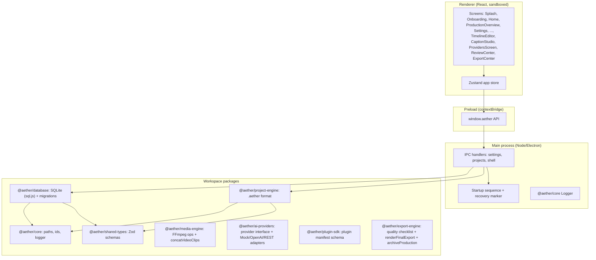

# Architecture

## Overview

## Why this stack

The spec calls for Electron + React + TypeScript + Vite + SQLite + FFmpeg,
npm/monorepo, Zod, Electron Builder. Phase 1 implements the shell of that
stack minus FFmpeg (deferred to Phase 3, where it's actually exercised).

- **Electron + electron-vite**: electron-vite bundles main/preload/renderer
  from a single config and gives the renderer real Vite HMR in dev, which
  plain `electron` + hand-rolled Vite config does not.
- **npm workspaces monorepo**: `apps/desktop` + `packages/*`, matching the
  spec's package boundaries (core, database, project-engine, shared-types,
  media-engine, ai-providers, plugin-sdk, and export-engine today; security
  and testing arrive with the phases that need them -- see
  [ROADMAP.md](ROADMAP.md). A dedicated `timeline-engine` package named in
  the original roadmap turned out not to be needed -- Phase 5's timeline
  logic split cleanly across the existing `shared-types` (data model),
  `media-engine` (the one real processing step, `concatVideoClips()`), and
  renderer-local UI state, with no leftover code that would justify an empty
  intermediate package).
- **Zod everywhere data crosses a boundary**: the `.aether` manifest, IPC
  payloads, and the app-settings blob are all defined once in
  `@aether/shared-types` and validated on read, not just on write.

## Key decision: sql.js instead of better-sqlite3

The spec names SQLite explicitly. The natural choice, `better-sqlite3`, is a
native Node addon that must be compiled per Node/Electron ABI via node-gyp,
which requires a working MSVC + Windows SDK toolchain. On this development
machine (and likely on many contributors' and users' machines) that
toolchain is not installed, and `npm install` failed outright trying to
compile it (see git history / KNOWN_LIMITATIONS.md for the exact failure).

Instead, `packages/database/src/sqlJsAdapter.ts` wraps **sql.js** (SQLite
compiled to WebAssembly, pure JS bindings, zero native compilation) behind a
facade shaped like `better-sqlite3`'s API (`.exec()`, `.prepare().run/get/all()`,
`.transaction()`). This means:

- The repositories (`ProjectsRepository`, `SettingsRepository`,
  `ActivityLogRepository`) and the migration runner are written exactly as
  they would be against better-sqlite3 -- no leakage of the WASM detail
  upward.
- The tradeoff: sql.js keeps the whole database in memory and the adapter
  writes the full file back to disk after every mutating statement. Fine at
  this app's metadata scale (projects, settings, activity log -- thousands of
  rows, not millions). If that ever becomes a bottleneck, swapping the
  adapter's internals for better-sqlite3 (once a build toolchain is assumed
  present, e.g. in CI) requires no changes to calling code.
- If you *do* have Visual Studio Build Tools with the "Desktop development
  with C++" workload installed, you can switch back by changing the
  `sql.js` dependency to `better-sqlite3` and reimplementing
  `sqlJsAdapter.ts`'s two exports (`AetherRawDatabase`, `loadSqlJsDatabase`)
  against it -- the rest of the codebase does not need to change.

## Key decision: workspace packages ship TypeScript source directly

`@aether/core`, `@aether/database`, `@aether/project-engine`, and
`@aether/shared-types` have no build step of their own -- their `package.json`
`"main"` points straight at `src/index.ts`. electron-vite's Rollup-based
main/preload bundler transpiles them in place. This avoids a `tsc -b`
composite-project build step for Phase 1, at the cost of needing
`electron.vite.config.ts` to explicitly **exclude** these packages from
`externalizeDepsPlugin()` (otherwise Node tries to `require()` raw `.ts`/ESM
`export` syntax at runtime and crashes on launch -- this exact failure
occurred during Phase 1 build verification and is captured in
[IMPLEMENTATION_STATUS.md](IMPLEMENTATION_STATUS.md)).

A real third-party dependency of a bundled workspace package (e.g. `sql.js`,
a dependency of `@aether/database`) must also be declared directly in
`apps/desktop/package.json`, or electron-vite's dep-scanning (which only
reads the app's own `package.json`) won't know to externalize it either, and
Rollup will try to inline sql.js's UMD wrapper and break it.

## The .aether project format

See [PROJECT_FORMAT.md](PROJECT_FORMAT.md). In short: a project is a folder
with a standard set of subdirectories and a `project.aether` JSON manifest,
written atomically (temp file + rename) and snapshotted to `/backups` before
every save.

## Key decision: media processing isolated in packages/media-engine

Every FFmpeg/ffprobe interaction (probing, thumbnail extraction, waveform
image generation, and as of Phase 4 audio/video editing operations -- trim,
loudness normalization, denoise, silence removal, merge, format conversion,
speed adjustment) lives behind `packages/media-engine`'s typed function
exports -- nothing else in the codebase builds an FFmpeg argument list or
spawns that process directly. `runProcess()` always uses
`child_process.execFile` with an argument array, never a shell string, so
no filename or user input can be reinterpreted as shell syntax regardless
of its content. See [FFMPEG_INTEGRATION.md](FFMPEG_INTEGRATION.md) for the
full design, including how the `ffmpeg-static`/`ffprobe-static` binaries are
located and what happens when FFmpeg genuinely isn't available.

## Key decision: Screen Capture reuses the Asset Library's build pipeline

`apps/desktop/src/main/assetBuilder.ts` (`buildAssetFromFile` and its
helpers) was extracted out of `assetsIpc.ts` in Phase 4 so
`screenCaptureIpc.ts` could reuse the identical checksum/probe/thumbnail
logic for a freshly-recorded clip. A screen recording is a normal `Asset`
(category `screen-recordings`), not a separate schema -- it gets the same
duplicate detection, missing-file handling, and preview generation as
anything imported through the Asset Library, plus a `notes` field recording
which capture options (mic, system audio, source type) were used.

## Process boundaries

- **Renderer**: `contextIsolation: true`, `nodeIntegration: false`, `sandbox:
  false` (sandbox is disabled only because the preload script needs
  `contextBridge` + Node's `path`-free API surface; no Node APIs are exposed
  to the page itself). All privileged work happens in main via
  `ipcMain.handle`.
- **Main**: owns the SQLite-via-sql.js connection, the filesystem, and
  `dialog`/`shell`. Every IPC handler returns a discriminated `{ ok: true,
  ... } | { ok: false, error }` shape so the renderer never has to guess
  whether a call succeeded.
- **Logging**: `@aether/core`'s `Logger` redacts any object key matching
  `/api[_-]?key|token|secret|password|authorization/i` before writing to
  disk, and writes to `%APPDATA%/Aether Studio Suite/logs/aether-YYYY-MM-DD.log`.

## Key decision: cross-project entities live in the app database, not a manifest

Most of what Phase 2 adds (brands, characters, scripts, storyboard frames,
prompts, knowledge sources) belongs to one production and lives as an array
inside that production's `project.aether` -- edited in place via
`useAppStore.updateAndSave()`, which mutates the in-memory manifest and
calls the existing `projects:save` IPC handler from Phase 1. No new IPC was
needed for any of those.

The **Series & Curriculum Planner** is the one Phase 2 exception: a series
spans multiple productions/episodes, so it doesn't belong inside any single
project.aether. It's stored globally in the app database instead
(`series_plans` table, migration `0002_series_plans.sql`), following the
same pattern Phase 1 already established for `character_library` and
`brand_library` (present in the schema since migration `0001_init.sql` but
still unused by any screen -- promoting a project-local character/brand to
that shared library is a natural Phase 3+ extension of the same pattern).

Phase 6's `provider_configurations` and `background_jobs` tables follow the
identical pattern for the same reason: an AI provider you've configured
(and paid for) is a property of your whole installation, not of any one
production, so it belongs in the app database rather than duplicated (or
worse, its API key duplicated) across every `project.aether` a user
creates.

## Key decision: provider secrets never leave the main process in plaintext

`ProviderConfigRepository` stores only ciphertext (base64 of Electron
`safeStorage.encryptString()`'s output) in `provider_configurations.encrypted_secret`
-- it has no encrypt/decrypt methods of its own, by design, so there is no
code path in that class that could accidentally persist or return a
plaintext secret. `apps/desktop/src/main/secretsStore.ts` is the only place
encryption/decryption happens. The renderer's `ProviderConfig` type (what
`providers:list` returns) has no secret field at all, only a `hasSecret`
boolean -- a provider's API key is write-only from the renderer's
perspective: you can set it or clear it when saving a config, but the
renderer can never read one back. `@aether/ai-providers`'s provider
implementations receive an already-decrypted secret string as a
constructor argument from the IPC handler; they never touch the database
or `safeStorage` themselves.

## Key decision: the timeline's playback clock is wall-clock, not frame-locked

`TimelineEditor.tsx` drives `playheadSeconds` from a `requestAnimationFrame`
loop advancing by wall-clock delta time, and the preview `<video>` plus one
`<audio>` element per audio track follow that shared clock -- seeking on
clip change, then periodically re-seeking only if they drift more than 0.3s
from where they should be, rather than the playhead being derived from any
one media element's own `currentTime`. This keeps multiple independent
media elements (one video, several audio tracks) in acceptable sync for a
preview editor with a simple mental model, at the cost of not being
frame-accurate. See KNOWN_LIMITATIONS.md.

## Key decision: the Quality-Control checklist is a pure function, not a service

`runQualityChecklist()` (`packages/export-engine`) takes a `ProjectManifest`
and returns `QualityCheck[]` -- no ffmpeg, no filesystem access, no network,
nothing async. This is deliberate: both the Export Center and the Review &
Approval screen need the same checklist, and a pure function is trivially
shareable and re-runnable (on every visit to either screen) without needing
a caching layer or a "is this stale" question. It's also why the checklist
is fully covered by fast unit tests rather than needing ffmpeg fixtures the
way `renderFinalExport()` does.

## Key decision: exports and archives reuse existing patterns, not new ones

A rendered export becomes a normal `Asset` (category `exports`) through the
same `buildAssetFromFile` pipeline established in Phase 3 and reused by
Phase 4's screen recordings, Phase 5's timeline preview, and Phase 6's
AI-generated images -- Phase 7 did not introduce a separate "export record"
concept. Likewise, a production archive is written to a plain `archives/`
subfolder inside the project directory, following the same convention as
the existing `renders/`, `backups/`, and `cache/` subfolders from Phase 1's
project structure, rather than adding a save-location dialog or a new
top-level concept.

## What's still deliberately not built (see ROADMAP.md / KNOWN_LIMITATIONS.md)

- No delivery-quality project export encoding (Phase 7) -- Phase 5's
  `concatVideoClips()` produces a video-only quick preview render for
  confirming a timeline edit, not the final export pipeline.
- No real AI provider has been exercised against a live network endpoint
  (Phase 6's `OpenAiCompatibleProvider`/`GenericRestProvider` are real
  clients, not stubs, but there are no API credentials in this
  environment). Voice cloning in particular is not built at all, by design
  (see KNOWN_LIMITATIONS.md).
- No real plugin loader -- `@aether/plugin-sdk` validates the manifest
  contract a plugin must satisfy but does not discover, load, or execute
  third-party plugin code; that's a deliberately separate, later effort
  given the security surface involved.
- AI-assist actions exist for exactly three buttons (Script Studio's
  Generate Outline/Improve Hook, Storyboard Studio's Generate Frame Image)
  -- the provider layer is generic enough to support more, but wiring every
  AI-assist action named across the spec into every screen is future work.
- No animation generation, no OS-level input-hook overlays (click
  indicators, keystroke display) during screen capture, no dedicated Audio
  Mixer screen (audio tracks live inside the Timeline Editor instead), no
  drag-and-drop clip editing (numeric controls only, see
  KNOWN_LIMITATIONS.md).
- Final export composites the primary video track, audio tracks, and
  captions only -- graphics/titles/overlays tracks are not burned into the
  delivered video, and export presets are a fixed built-in list rather
  than a user-editable/CRUD screen.
- The persistent nav sidebar lists all the modules from the spec. As of
  Phase 7, Home, Settings, Series, Knowledge, Scripts, Storyboards, Prompts,
  Characters, Brands, Assets, Voice, Screen Capture, Timeline, Audio,
  Captions, Providers, Review, and Export are wired up; the remaining items
  (Animation, Templates, Learning Center) are disabled buttons with a
  tooltip naming the phase they arrive in. This is intentional -- see spec
  section 44 ("prepare clean interfaces for future expansion without
  filling the interface with nonfunctional placeholders"); a full
  click-through experience for unbuilt modules would be exactly that kind
  of placeholder.
